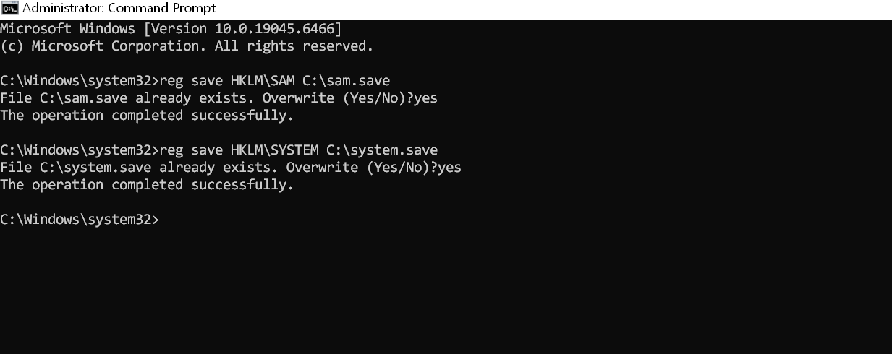
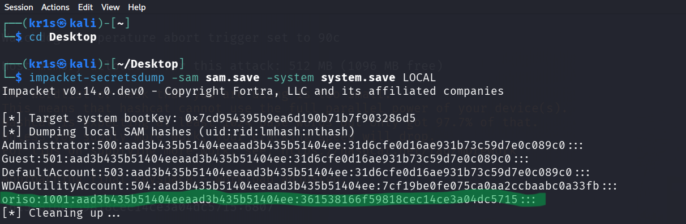
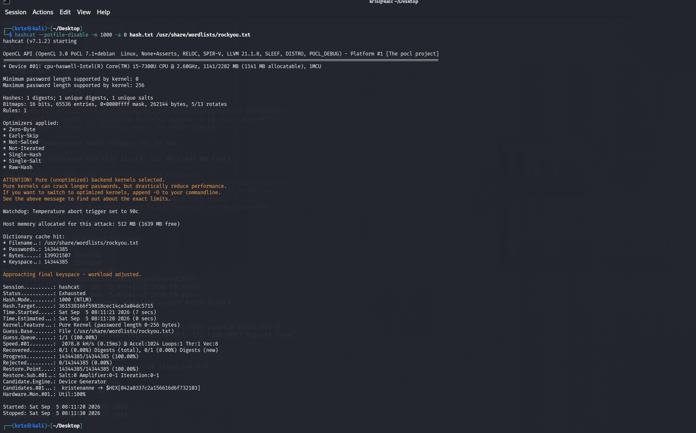
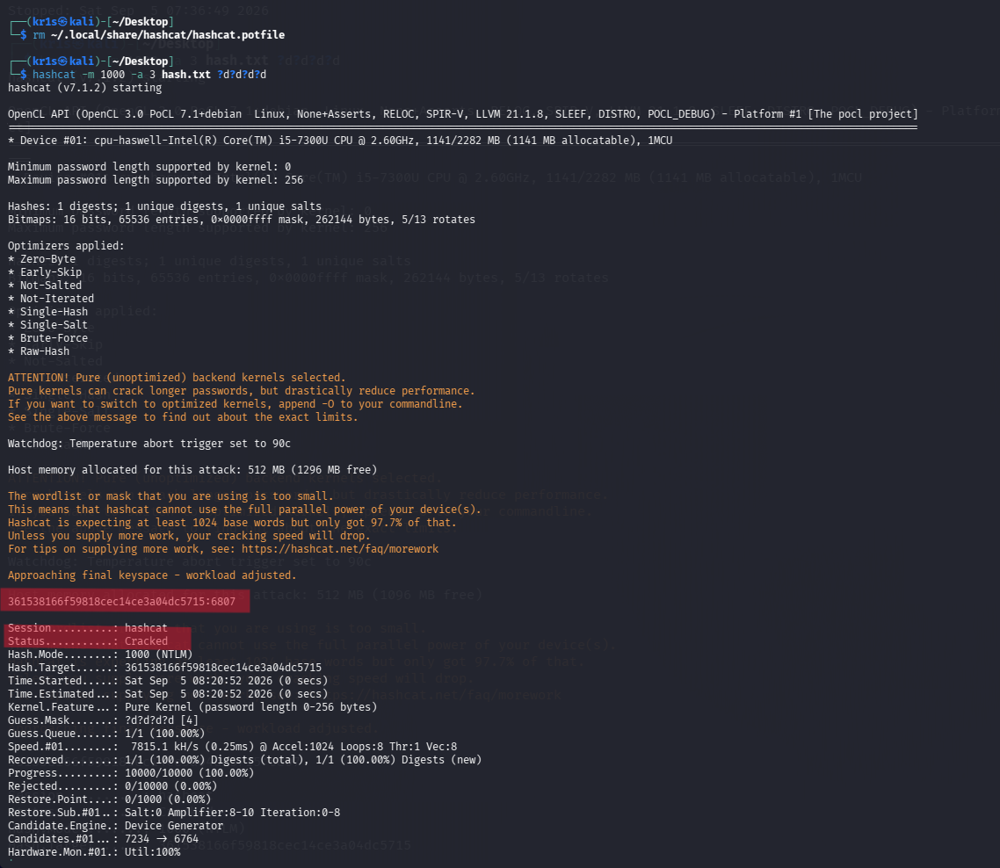
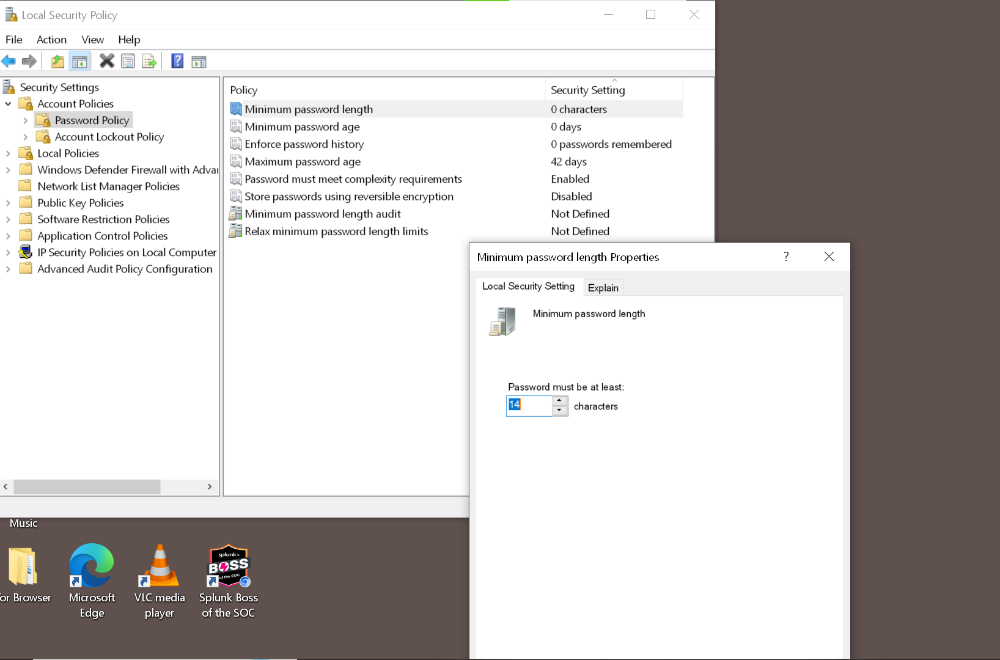

# Windows Password Audit with Hashcat

## Objective
This lab demonstrates the process of extracting Windows local account hashes (SAM) and auditing their strength using industry-standard password cracking tools. The goal is to highlight the risks of weak passwords and provide defensive recommendations.

## Tools Used
- **Windows 10** (Victim Machine)
- **Kali Linux** (Attacker/Auditor Machine)
- **Impacket (secretsdump)** - Credential Extraction
- **Hashcat** - Password Cracking

## Methodology

### 1. Extraction (Windows 10)
I used built-in Windows registry tools to create a shadow copy of the SAM and SYSTEM files, which store local hashes. 

`reg save HKLM\SAM C:\sam.save`
`reg save HKLM\SYSTEM C:\system.save`

I then transferred these files to my Kali Linux machine.

### 2. Hash Extraction (Kali Linux)
Using the `impacket-secretsdump` tool, I extracted the NTLM hashes from the SAM file:

`impacket-secretsdump -sam sam.save -system system.save LOCAL`

**Result:** The hash for the local user `oriso` was extracted.

**Hash:** `361538166f59818cec14ce3a04dc5715`

### 3. Cracking Attempt (Kali Linux)
I first attempted a standard Dictionary Attack using the `rockyou.txt` wordlist (14 million passwords).

`hashcat -m 1000 -a 0 hash.txt /usr/share/wordlists/rockyou.txt`

**Result:** Exhausted (Password not found in dictionary).

Since this failed, I ran a Brute-Force Mask Attack targeting 4-digit PINs:

`hashcat -m 1000 -a 3 hash.txt ?d?d?d?d`

**Result:** Cracked in under 1 second. 

**Password Found:** `6807`

## Analysis
A 4-digit PIN only has 10,000 possible combinations. Modern CPUs can test all 10,000 combinations fastly. This proves that using short numeric passwords equals **zero security** against offline attacks.

## Defensive Recommendations
1. **Strong Password Policy:** Enforce a minimum length of 14 characters, mixing uppercase, lowercase, numbers, and symbols.
2. **Disable/Protect Local Accounts:** Local accounts are vulnerable to SAM extraction. Use Azure AD or Active Directory for centralized management.
3. **Implement MFA:** Even if attackers steal a hash, Multi-Factor Authentication prevents them from logging in with it.
4. **Endpoint Detection & Response (EDR):** Deploy tools (like Sysmon) to monitor and alert on the execution of `reg save`, `secretsdump`, or Mimikatz, as these are critical attack indicators.

## Proof of Work

